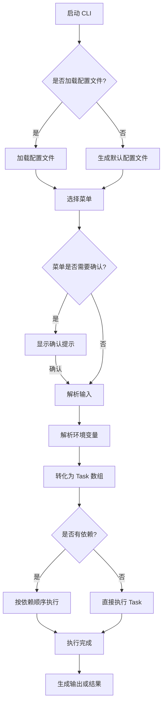
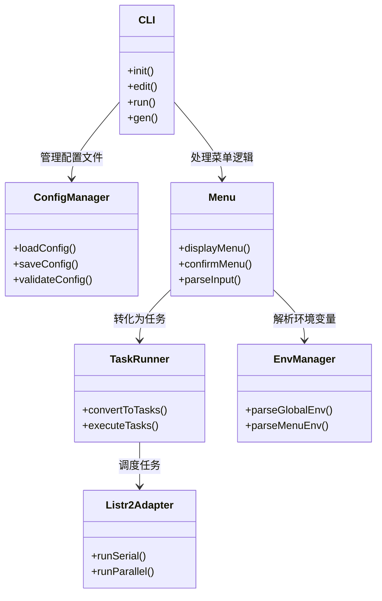

# CLI 菜单工具技术设计

## 程序执行逻辑

## 系统组件对应关系

## 说明

1. **程序执行逻辑**：
   - 程序从 CLI 启动，判断是否加载配置文件。
   - 根据用户选择的菜单，解析输入和环境变量。
   - 将菜单转化为任务数组，并根据依赖关系和执行模式（串行或并行）执行任务。
   - 最终生成输出或结果。

2. **系统组件对应关系**：
   - **CLI**：负责处理用户输入的核心指令（如 `init`、`edit`、`run`、`gen`）。
   - **ConfigManager**：负责加载、保存和验证配置文件。
   - **Menu**：负责菜单的显示、确认和输入解析。
   - **TaskRunner**：负责将菜单转化为任务数组，并调度任务执行。
   - **EnvManager**：负责解析全局和菜单级环境变量。
   - **Listr2Adapter**：封装 `listr2` 的串行和并行执行逻辑。
