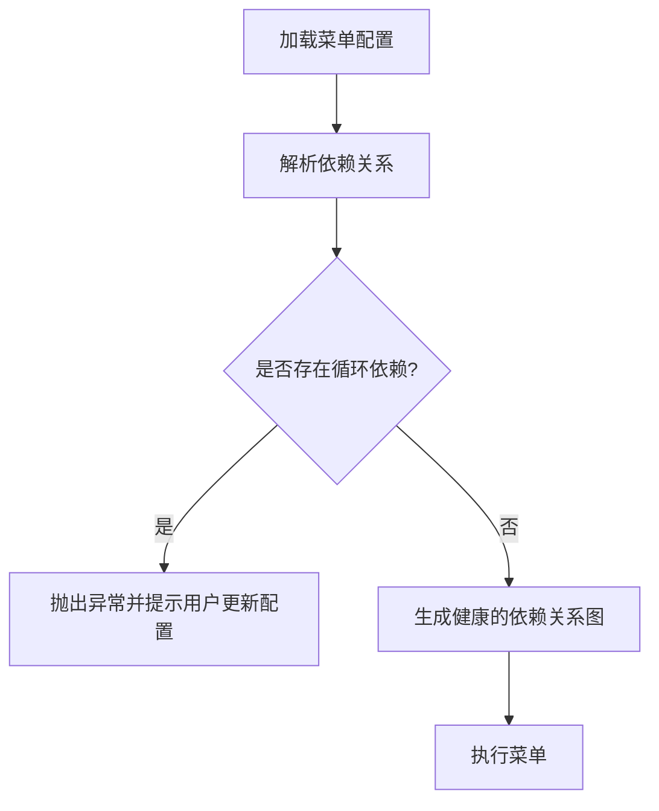
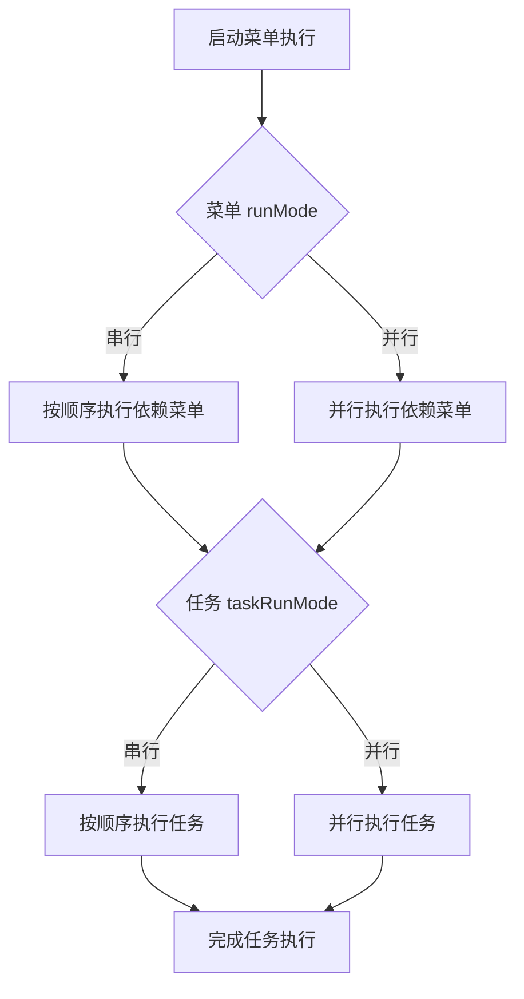

# 更新后的需求评审与设计优化

## 冲突与解决方案

### 菜单依赖关系的无限递归问题
- **问题**：如果菜单 A 依赖菜单 B，菜单 B 又依赖菜单 A，可能导致无限递归。
- **解决方案**：
  - 在加载菜单配置时，进行依赖分析。
  - 如果检测到循环依赖，直接抛出异常，并以可视化的文字提示用户更新配置。
  - 这样可以确保运行时的依赖关系是健康的。

### `runMode` 和 `taskRunMode` 的优先级与定义
- **问题**：`runMode` 定义菜单及其依赖菜单的执行模式（串行或并行），`taskRunMode` 定义当前菜单的任务执行模式（串行或并行）。两者的关系需要明确。
- **解决方案**：
  - `runMode` 和 `taskRunMode` 默认值均为串行。
  - `runMode` 仅影响菜单及其依赖菜单的执行顺序。
  - `taskRunMode` 仅影响当前菜单的任务执行顺序，互不冲突。

### 环境变量解析的优先级
- **问题**：全局环境变量和菜单级环境变量可能存在冲突。
- **解决方案**：
  - 菜单环境变量优先级高于全局环境变量，菜单变量可以覆盖全局变量。
  - 当 `value` 是函数时，菜单变量和环境变量分别存储在 `ctx.menuEnv` 和 `ctx.env` 中，避免冲突。

### 适配器兼容性问题
- **问题**：`listr2` 的适配器可能不支持所有 `inquirer` 的输入类型（如 `multiSelect`）。
- **解决方案**：
  - 如果调研发现适配器不兼容某些输入类型，则暂不实现这些功能，避免引入不稳定因素。

---

## 实现重点与难点

### 依赖关系解析
- **重点**：实现一个依赖解析器，能够检测并处理循环依赖。
- **难点**：需要高效的算法（如深度优先搜索）来解析依赖关系，并在检测到循环依赖时提供清晰的错误提示。

### 调度模式的优先级
- **重点**：明确 `runMode` 和 `taskRunMode` 的优先级规则，并在实现中严格遵守。
- **难点**：在复杂的依赖关系中，确保调度模式的切换逻辑清晰且无冲突。

### 环境变量解析
- **重点**：设计一个高效的环境变量解析器，能够动态合并全局和菜单级环境变量。
- **难点**：在任务执行过程中，确保环境变量的隔离性和优先级规则。

### 适配器兼容性
- **重点**：验证 `listr2` 和 `inquirer` 的适配器兼容性，确保支持所有必要的输入类型。
- **难点**：如果发现不兼容，需要设计替代方案或明确功能限制。

---

## 更新后的设计

### 依赖关系解析
- **新增功能**：循环依赖检测。
- **逻辑**：
  - 使用深度优先搜索（DFS）解析依赖关系。
  - 在解析过程中，维护一个访问栈（stack），如果发现当前节点已经在栈中，则存在循环依赖。
  - 抛出异常并提示用户更新配置。

### 调度模式优先级
- **规则**：
  - `runMode` 影响菜单及其依赖菜单的执行顺序。
  - `taskRunMode` 影响当前菜单的任务执行顺序。
  - 两者互不冲突，默认值均为串行。

### 环境变量解析
- **规则**：
  - 菜单环境变量优先级高于全局环境变量。
  - 当 `value` 是函数时，菜单变量和环境变量分别存储在 `ctx.menuEnv` 和 `ctx.env` 中。

### 适配器兼容性
- **规则**：
  - 验证 `listr2` 和 `inquirer` 的适配器兼容性。
  - 如果发现不兼容的输入类型（如 `multiSelect`），暂不实现相关功能。

---

## 图示

### 菜单依赖关系解析逻辑

### 调度模式与任务执行逻辑

---

## 下一步

是否需要进一步细化某个部分的设计，或者直接开始实现依赖关系解析的功能？
