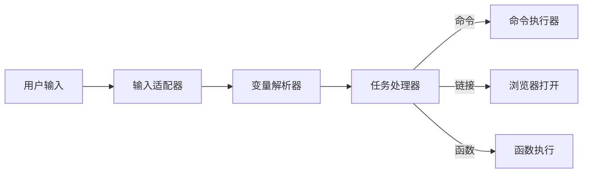

# CLI Menu 系统模式
## 系统架构

## 关键技术决策
- 变量解析优先级：输入变量 > 菜单环境变量 > 全局环境变量（确保用户实时输入覆盖预设配置）
- 无状态设计：EnvResolver每次实例化时独立解析（避免上下文污染）
- 类型安全：所有核心接口使用type-fest增强类型定义

## 组件关系
- EnvResolver负责变量替换，输出纯字符串/数组
- TaskHandler根据菜单项类型（command/link/function）分发执行逻辑
- InputAdapter抽象不同交互库（如inquirer）的输入实现
